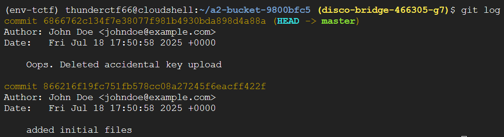
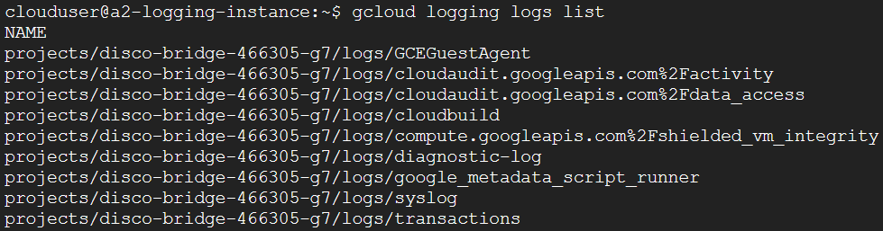
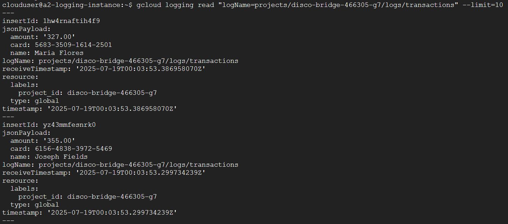
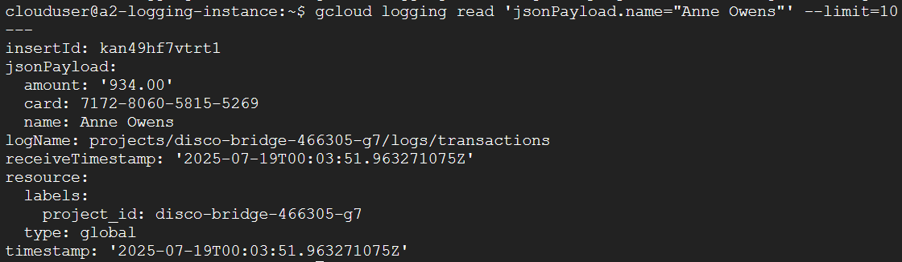

# a2finance

## First Steps and Looking at Buckets

After doing the setup, we are told from the `test-permissions.py` script we are given that we have the following permissions:

`['compute.instances.get', 'compute.instances.list', 'compute.zones.get', 'compute.zones.list', 'storage.buckets.list', 'storage.objects.get', 'storage.objects.list']`

Given the previous level, looking at what storage exists will likely be helpful. Running `gcloud storage ls` reveals a bucket has been created `a2-bucket-...`.

Running ls on the bucket gives us a .git folder and a main.py file. The main.py file only contains the line `print('hello')`. Let's try to dig into the git repository.

After copying the bucket with `gsutil cp`, running `git log` shows an interesting commit.

After switching to this older commit we see it contains an ssh private key we might be able to use somewhere.

## VM Instances

Next, we can try seeing if this project has any VM instances. Running `gcloud compute instances list` shows there is a VM called `a2-logging-instance`. Maybe we can use the ssh key we found to ssh into this VM.

To learn a bit more about the VM instance we can run `gcloud compute instances describe a2-logging-instance`. In the output of this command, we see there is a public key for a user `clouduser`. If we then take this username and public key we get into the VM.

We can guess from the name of the instance that this VM is being used to host some kind of logging service. Checking under `/var/log` we can see if there are any items that stand out and there is something here `google-fluentd`.

So, we know this instance is definitely being used to manage logs used within the project. We can guess it has higher access to these logs than we do so we can try `gcloud logging logs list` to see what might be there.

Under the logs, we see a transactions log which is probably where we want to check considering we are looking for a credit card number.

## Investigating the Logs

We can use `gcloud logging read "logName=projects/{projectId}/logs/transactions" --filter=10` to take a peak at some of the log enteries and we see that they contain credit card numbers under `jsonPayload.card` and are labelled with a name as well.

We know the number are after is of someone named "Anne Owens". So, we can just modify our query to find that exact name.

With that we have solved the level. In this instance, the credit card number of Anne Owens is `7172-8060-5815-5269`.