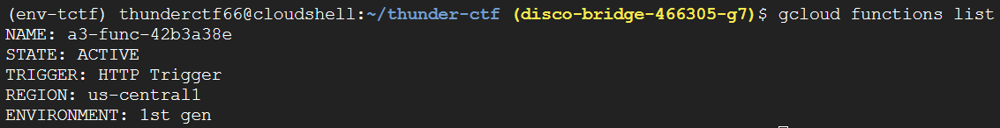
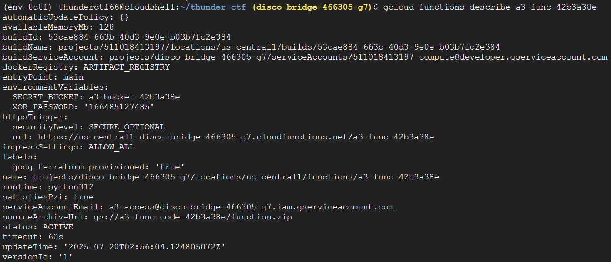
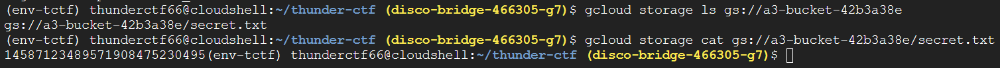
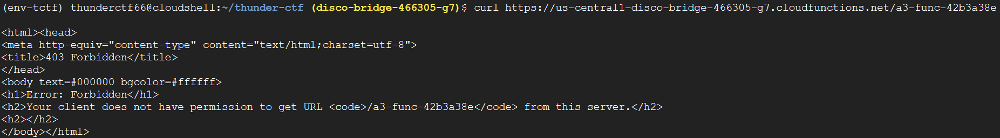
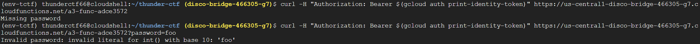

# a3password

Instructions: "Use the given compromised credentials to find the secret hidden in the level."

## Cloud Functions

After running `test-permissions.py` we see that we have a number of permissions related to gcloud functions. Running `gcloud functions list` gives us a single function named `a3-func-...` that has an HTTP trigger.

Then, running `gcloud functions describe` gives us some very useful information. We can see that there are two enviornment variables called `SECRET_BUCKET` and `XOR_PASSWORD`

## Hidden Bucket

Running `gcloud storage ls` tells us that this "secret bucket" contains a single file `secret.txt`. We are then freely able to cat the file and get its contents, which is just a large number.

This might be useful for later but at the moment we don't have anything to use this with.

## Running Cloud Function

Let's return to that cloud function from before and try calling it. It's an HTTP function so that means we can trigger it with `curl` and the URL under `httpsTrigger`.

Doing this, gives us a 403 "Forbidden" error letting us know we don't have the proper permissions. To get past this, we can authenticate our request by including our auth token in the request header.

After doing this, we get the response "Missing password. We can try to add a password by simply appending "?password=foo" to the URL and we get a Python error telling us the password should be a decimal.

Most likely, we are meant to use the integer we found in secret.txt. We also have that enviornment variable which was an integer which judging by its name we might have to XOR against secret.txt.

